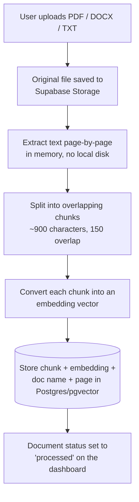
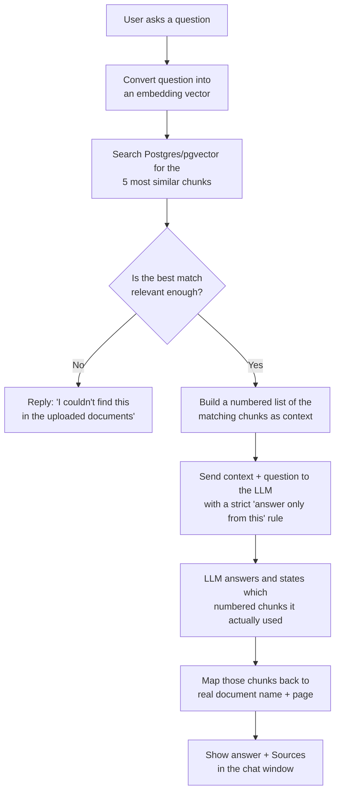

# Docuery — AI-Powered Document RAG Chatbot Dashboard

Docuery lets you upload documents (PDF, DOCX, or TXT) and ask questions
about them in plain English. It reads your documents, breaks them into
small pieces, converts those pieces into searchable "embeddings," and
uses that as the only source of truth when answering your questions.

If the answer isn't in your documents, Docuery says so instead of
guessing — and every answer shows exactly which document and page it
came from.


## Table of Contents

- [What It Does](#what-it-does)
- [How It Works](#how-it-works)
- [Tech Stack](#tech-stack)
- [Project Structure](#project-structure)
- [Run It Locally](#run-it-locally)
- [Environment Variables](#environment-variables)
- [API Reference](#api-reference)
- [Testing](#testing)
- [Known Limitations](#known-limitations)

---

## What It Does

- **Upload documents** — drag and drop PDF, DOCX, or TXT files. You can
  watch each one move through `processing → processed` (or `failed`, with
  a clear error message) on the Documents page.
- **Dashboard at a glance** — total documents, how many are processed vs.
  still processing vs. failed, total chunks indexed, and total questions
  asked. All numbers come live from the database — nothing is hardcoded.
- **Chat with your documents** — start a new chat, ask a question, and
  get an answer with a "Sources" section underneath it, e.g.
  `📄 Company_Overview.pdf — Page 3`.
- **Refuses to make things up** — if your documents don't contain the
  answer, Docuery replies with a clear "I couldn't find this" message
  instead of inventing one. See [How It Works](#how-it-works) for exactly
  how that's enforced.
- **Works with the AI provider you already have** — OpenAI, Azure OpenAI,
  Anthropic, Gemini, or a fully free local setup with Ollama. Switch
  providers with one environment variable, no code changes.

## How It Works

Docuery has two independent flows: one for getting documents *into* the
system, and one for answering questions *out of* it.

### 1. Document ingestion — turning a file into searchable knowledge



This all happens in the background right after upload, so the person
uploading doesn't have to wait — the dashboard shows live status while it
runs.

### 2. Question answering — turning a question into a grounded answer



### Why it doesn't hallucinate

Three separate safeguards work together, so no single point of failure
can let the bot make something up:

1. **No-context short-circuit** — if nothing relevant is found, the
   question never even reaches the LLM. The app returns the fixed
   "couldn't find this" message immediately.
2. **A strict system prompt** — when the LLM is called, it's told, in
   plain terms, to answer only from the numbered context it was given,
   and to use one exact fallback sentence whenever that context isn't
   enough — no exceptions for "things it happens to know."
3. **Citations are real, not decorative** — the model has to say which
   numbered chunks it used. Those numbers map straight back to actual
   retrieved chunks, so every "Source" shown in the UI is traceable to a
   real chunk from a real document — never invented after the fact.

## Tech Stack

| Layer | Choice |
|---|---|
| Backend | Python 3.11, FastAPI, Uvicorn |
| Metadata storage | Supabase Postgres (`documents`, `chats`, `messages` tables) |
| Vector storage | The same Supabase Postgres database, using the **pgvector** extension — no separate vector database service to run |
| File storage | Supabase Storage (holds the original uploaded PDFs/DOCX/TXT) |
| Embeddings | Local (`sentence-transformers`, free) or OpenAI / Azure OpenAI |
| LLM | OpenAI, Azure OpenAI, Anthropic, Gemini, or Ollama — chosen via one environment variable |
| Document parsing | `pypdf` (PDF), `python-docx` (DOCX), plain text decode (TXT) — all done in memory |
| Frontend | Plain HTML / CSS / JavaScript, no build step, served directly by FastAPI |

**Why Supabase for everything?** Render's free tier wipes local disk
every time the container restarts or redeploys. By keeping all state —
document metadata, chat history, and the vector embeddings themselves —
in Supabase Postgres, and the original files in Supabase Storage, the
backend container itself holds nothing permanent. That means it's always
safe to restart, redeploy, or let it spin down when idle.

## Project Structure

```
rag-dashboard/
├── Dockerfile                     # stateless container image, no volume needed
├── backend/
│   ├── main.py                    # FastAPI app entrypoint
│   ├── requirements.txt
│   ├── .env.example                # copy this to .env and fill in your values
│   └── app/
│       ├── config.py               # reads every setting from the environment
│       ├── database.py             # Postgres metadata: documents / chats / messages
│       ├── storage.py              # Supabase Storage: upload / download / delete files
│       ├── document_processor.py   # extracts text from PDF / DOCX / TXT
│       ├── chunking.py             # splits text into overlapping chunks
│       ├── embeddings.py           # turns text into vectors (local or API-based)
│       ├── vector_store.py         # pgvector: store + similarity search
│       ├── llm_client.py           # one interface over every supported LLM provider
│       ├── rag_engine.py           # retrieval + grounded prompt + guardrails
│       ├── pipeline.py             # wires extract → chunk → embed → store together
│       ├── schemas.py              # request/response data models
│       └── routers/
│           ├── documents.py        # upload / list / delete / reprocess
│           ├── chat.py             # create chat, ask questions
│           └── dashboard.py        # dashboard counters
├── frontend/
│   ├── index.html
│   ├── styles.css
│   └── app.js
├── docs/                            # sample real-estate PDFs used for testing
└── sample_docs/
    └── generate_sample_pdfs.py      # regenerates the 5 sample test PDFs
```

## Run It Locally

### Step 1 — Set up Supabase (free tier is enough)

1. Create a project at [supabase.com](https://supabase.com).
2. Go to **Database → Extensions**, search for `vector`, and enable it.
   (The app also tries to enable this automatically on first run, but
   doing it here once removes any doubt.)
3. Go to **Storage → New bucket** and create a bucket named `documents`
   (private is fine — the backend uses the service_role key, not the
   public one).
4. Collect three values from **Project Settings**:
   - **Database → Connection string** → this is your `DATABASE_URL`
   - **API → Project URL** → this is your `SUPABASE_URL`
   - **API → service_role key** → this is your `SUPABASE_SERVICE_KEY`
     (not the `anon` key — that one can't write to Storage the way the
     backend needs to)

### Step 2 — Configure and run the backend

```bash
cd backend
python -m venv venv
source venv/bin/activate        # Windows: venv\Scripts\activate
pip install -r requirements.txt
cp .env.example .env
```

Open `.env` and fill in:

- `DATABASE_URL`, `SUPABASE_URL`, `SUPABASE_SERVICE_KEY` from Step 1.
- An LLM provider — pick one:
  - **OpenAI:** `MODEL_PROVIDER=openai`, `MODEL_NAME=gpt-5-mini`, `OPENAI_API_KEY=...`
  - **Azure OpenAI:** `MODEL_PROVIDER=azure_openai` plus `AZURE_OPENAI_ENDPOINT`,
    `AZURE_OPENAI_API_KEY`, and `AZURE_OPENAI_DEPLOYMENT` (the deployment
    *name* you chose in Azure, not necessarily the model name itself).
  - **Free/local:** `MODEL_PROVIDER=ollama` with [Ollama](https://ollama.com)
    installed and running (`ollama pull llama3.1`).
- An embedding provider — `local` (free, no key, 384 dimensions),
  `openai`, or `azure_openai` (1536 dimensions for `text-embedding-3-small`).
  Whichever you pick, make sure `EMBEDDING_DIM` matches its output size.

Then start the server (it serves the frontend too):

```bash
uvicorn main:app --reload --port 8000
```

Open **http://localhost:8000** — the dashboard, document manager, and
chat are all there.

> First run downloads the local embedding model (~80 MB) if you're using
> `EMBEDDING_PROVIDER=local` — that needs internet access once.

### Step 3 — Load the sample test documents

```bash
cd sample_docs
pip install reportlab
python generate_sample_pdfs.py
```

This creates five PDFs for a fictional company, **Meridian Realty
Group** (Company Overview, Property Listings, Services & Fees, FAQs,
Policies & Terms), written so facts are consistent across all five —
that's what makes cross-document questions and hallucination tests
meaningful. Upload them from the **Documents** tab.

## Environment Variables

Every variable is documented inline in
[`backend/.env.example`](backend/.env.example). The most important ones:

| Variable | Purpose |
|---|---|
| `DATABASE_URL` | Supabase Postgres connection string |
| `SUPABASE_URL` / `SUPABASE_SERVICE_KEY` | Supabase Storage access (server-side only) |
| `SUPABASE_BUCKET` | Storage bucket name for uploaded files |
| `EMBEDDING_PROVIDER` / `EMBEDDING_DIM` | `local`, `openai`, or `azure_openai`, and its vector size |
| `MODEL_PROVIDER` / `MODEL_NAME` | Which LLM to use, and which model |
| `OPENAI_API_KEY` / `AZURE_OPENAI_*` / `ANTHROPIC_API_KEY` / `GOOGLE_API_KEY` / `OLLAMA_BASE_URL` | Credentials for whichever provider you picked |
| `CHUNK_SIZE` / `CHUNK_OVERLAP` | How documents are split before embedding |
| `TOP_K` | How many chunks are retrieved per question |
| `MIN_RELEVANCE_SCORE` | Similarity cutoff below which the app answers "not found" instead of calling the LLM |
| `CORS_ORIGINS` | Which frontend origins may call the API |

**Never commit your real `.env` file.** It's already listed in
`.gitignore` — only `.env.example` (with no real secrets) should ever go
into GitHub.

## API Reference

| Method | Endpoint | Purpose |
|---|---|---|
| `POST` | `/api/documents` | Upload a document (multipart file) |
| `GET` | `/api/documents` | List all documents and their status |
| `GET` | `/api/documents/{id}` | Get one document's details |
| `DELETE` | `/api/documents/{id}` | Delete a document and its chunks |
| `POST` | `/api/documents/{id}/reprocess` | Re-run extraction/chunking/embedding |
| `POST` | `/api/chats` | Start a new chat |
| `GET` | `/api/chats` | List all chats |
| `GET` | `/api/chats/{id}/messages` | Get a chat's message history |
| `POST` | `/api/chats/{id}/messages` | Ask a question (runs the full RAG flow) |
| `GET` | `/api/dashboard/stats` | Dashboard counters |
| `GET` | `/api/health` | Health check |

Interactive, auto-generated docs are available at
`http://localhost:8000/docs` whenever the server is running.

## Testing

Test with the 5 sample documents and at least 10 questions, covering:
direct-answer questions, questions that span different parts of one
document, questions that require combining two documents, questions with
no answer anywhere in the documents, and questions designed to tempt the
model into hallucinating. Record the actual answer, the sources shown,
and pass/fail for each one — this is your test report deliverable.

## Known Limitations

- **DOCX page numbers are approximate.** Word files don't store fixed
  page numbers internally, so DOCX sources cite a section index rather
  than a printed page number.
- **The relevance cutoff is a heuristic.** `MIN_RELEVANCE_SCORE` may need
  tuning per embedding model, especially for very short or ambiguous
  questions.
- **Local embeddings are fast and free, but lower quality** than OpenAI's
  hosted embedding models on nuanced or paraphrased questions.
- **Switching embedding providers after documents are indexed requires
  re-uploading them** — the pgvector column has a fixed vector size set
  at first startup.
- **No user accounts.** This is a single-user evaluation build; all
  documents and chats are shared in one database, not scoped per user.
- **Background processing runs in-process** (FastAPI `BackgroundTasks`),
  which is fine at demo scale but wouldn't hold up under heavy concurrent
  load — a production version would use a real task queue (Celery/RQ).
